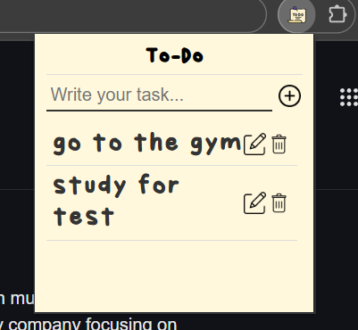

# To-Do List Chrome Extension 📝

A simple and modern to-do list Chrome extension inspired by a notepad design. This extension allows you to quickly add, edit, and delete tasks from a fixed-size popup.

## Gallery 🖼️

  

## Features ✨

- **Add Tasks:** Type a new task and click the add button ➕.
- **Edit Tasks:** Easily edit tasks by clicking the edit icon ✏️.
- **Delete Tasks:** Remove tasks using the delete icon 🗑️.
- **Modern Design:** Notepad-inspired design with a fixed square popup and scrollable list area 📜.
- **Custom Fonts:** Supports custom .otf fonts for a personalized look 🎨.

## Installation 🚀

1. **Clone or Download** the repository 📥.
2. Open Chrome and navigate to `chrome://extensions/` 🔧.
3. Enable **Developer Mode** (toggle in the top right) 🔄.
4. Click **Load unpacked** and select the extension's directory 📂.
5. The extension should now be available in your Chrome toolbar 🎉.

## File Structure 📁

- **popup.html:** The main HTML file for the popup.
- **styles.css:** CSS file containing the styles for the extension.
- **popup.js:** JavaScript file that handles functionality (add, edit, delete tasks).
- **manifest.json:** The manifest file that configures the extension.
- **icons/:** Folder containing icons used for the extension.
- **fonts/:** Folder containing custom fonts (if used).

